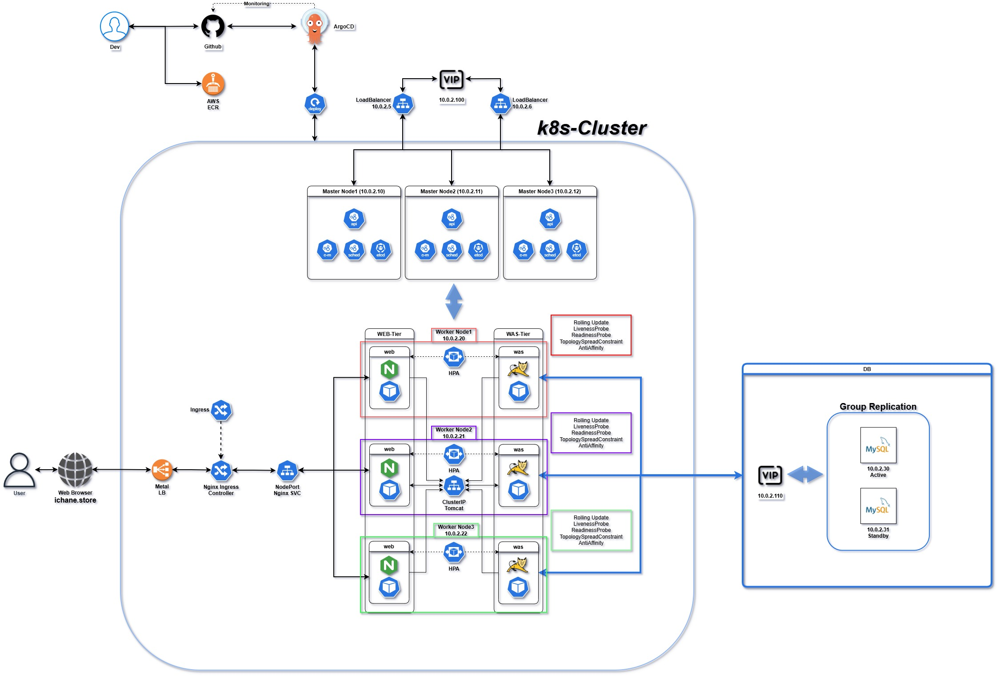

# 커뮤니티 웹 애플리케이션 - 컨테이너 기반 마이크로서비스 아키텍처

RAPA 커뮤니티 웹 애플리케이션 | 엔터프라이즈급 컨테이너 오케스트레이션 & 클라우드 네이티브 설계

## 📋 프로젝트 개요

이 프로젝트는 **클라우드 네이티브 원칙**을 적용한 **3계층 컨테이너 기반 웹 애플리케이션**입니다. Docker Compose를 통한 로컬 개발 환경부터 Kubernetes 배포까지 고려한 설계로, 확장성과 관찰성을 중심으로 구현되었습니다.

### 🎯 주요 특징

- **멀티스테이지 빌드 (Multi-stage Build)**: JRE 최소화를 통한 컨테이너 이미지 최적화 (800MB → ~150MB)
- **서비스 분리 아키텍처**: Nginx(Reverse Proxy) → Tomcat(Application) → MySQL(Data) 계층 분리
- **JNDI 기반 커넥션 풀링**: Tomcat의 DataSource를 통한 데이터베이스 연결 관리
- **환경 변수 기반 설정**: 개발/스테이징/프로덕션 환경 간 자동 구성
- **헬스체크 및 의존성 관리**: 서비스 시작 순서 자동화 및 상태 감시
- **로그 수집 및 네트워크 격리**: 컨테이너 로깅 전략 및 브리지 네트워크 구성
- **Infrastructure as Code (IaC)**: Docker Compose로 전체 인프라 정의
- **Kubernetes Ready**: 프로덕션 환경 배포 및 자동 확장 가능

---

## 🏗️ 시스템 아키텍처

### Local Development: Docker Compose Architecture

```
┌─────────────────────────────────────────────────────────────────┐
│                Docker Compose (IaC)                             |
├─────────────────────────────────────────────────────────────────┤
│                                                                 │
│  ┌──────────────┐      ┌──────────────┐      ┌──────────────┐   │
│  │  Nginx 1.14  │      │ Tomcat 10.1  │      │  MySQL 8.0   │   │
│  │ (Reverse Proxy)──→  │ (Application)├─────→│  (Database)  │   │
│  │  Port:  80    │      │  Port: 8080  │      │ Port: 3306   │  │
│  └──────────────┘      └──────────────┘      └──────────────┘   │
│        ▲                      ▲                      ▲          │
│        │                      │                      │          │
│   - Static Assets      - WAR Deployment       - Volume Mount    │
│   - Routing Rules      - JNDI DataSource      - Init Scripts    │
│   - Compression        - JVM Config           - Health Check    │
│                                                                 │
│  Network:  community-network (bridge driver)                    │
│  Volume: mysql-data (persistent storage)                        │
└─────────────────────────────────────────────────────────────────┘
```

### Production: Kubernetes Cluster Architecture

```

```

---

## 📂 프로젝트 구조

```
community/
├── src/                              # Java 소스코드 (69.4%)
│   └── com/rapa/community/
│
├── webapp/                           # WAR 아카이브 리소스
│   ├── WEB-INF/
│   │   ├── classes/                  # 컴파일된 클래스
│   │   ├── lib/                      # 라이브러리 의존성
│   │   │   ├── jakarta.servlet-api-6.0.0.jar
│   │   │   ├── jakarta.jakartaee-api-10.0.0.jar
│   │   │   └── mysql-connector-j-8.0.33.jar
│   │   └── jsp/
│   ├── css/                          # 스타일시트 (20.6%)
│   ├── img/                          # 이미지 자산
│   ├── index.jsp, home.jsp           # JSP 페이지들
│   ├── board.jsp, post.jsp
│   ├── profile.jsp, join.jsp
│   └── my-posts.jsp, my-comments.jsp, my-scraps.jsp
│
├── nginx/                            # Reverse Proxy (7.3%)
│   ├── Dockerfile
│   └── conf.d/default.conf
│
├── tomcat-config/                    # Tomcat 설정
│   └── context.xml                   # JNDI DataSource
│
├── mysql/                            # MySQL 초기화
│   └── init/*.sql
│
├── docker-compose.yml                # 서비스 오케스트레이션
├── Dockerfile                        # 멀티스테이지 빌드
├── build.sh                          # 빌드 스크립트
├── run.sh, stop.sh                   # 실행 스크립트
├── setenv.sh                         # JVM 환경변수
│
└── README.md                         # 이 파일
```

---

## 🚀 빠른 시작

### 사전 요구사항

```bash
- Docker >= 20.10
- Docker Compose >= 1.29
- Git
- Bash (Linux/macOS) 또는 WSL2 (Windows)
```

### 1️⃣ 저장소 클론

```bash
git clone https://github.com/LeeSangheee/community.git
cd community
```

### 2️⃣ 빌드

```bash
chmod +x build.sh
./build.sh
```

### 3️⃣ 실행

```bash
docker-compose up -d
# 또는
chmod +x run.sh
./run.sh
```

### 4️⃣ 접속

- 웹 애플리케이션: http://localhost:80
- MySQL: localhost:3306

---

## 🛠️ 운영 명령어

```bash
# 서비스 상태 확인
docker-compose ps

# 실시간 로그 모니터링
docker-compose logs -f

# 특정 서비스 로그
docker-compose logs -f tomcat
docker-compose logs -f nginx
docker-compose logs -f mysql

# 데이터베이스 접속
docker exec -it community-mysql mysql -u appuser -papppass community

# 중지 (데이터 유지)
docker-compose down

# 전체 삭제 (데이터 포함)
docker-compose down -v
```

---

## ⚙️ 설정 및 커스터마이징

### 포트 변경

```yaml
# docker-compose.yml
services:
  nginx:
    ports:
      - "8000:80"
  tomcat:
    ports:
      - "8081:8080"
  mysql:
    ports:
      - "3307:3306"
```

### 데이터베이스 비밀번호 변경

```yaml
# docker-compose.yml
services:
  mysql:
    environment:
      MYSQL_PASSWORD: your-new-password
```

```xml
<!-- tomcat-config/context.xml -->
<Resource ... password="your-new-password" />
```

### JVM 옵션 튜닝

```bash
# setenv.sh
export CATALINA_OPTS="-Xmx1024m -Xms512m -XX:+UseG1GC"
```

---

## 🔍 클라우드 아키텍처 관점

### 1. 컨테이너 최적화

**멀티스테이지 빌드:**
- Stage 1: JRE 최소화 (jlink로 커스텀 JRE 생성)
- Stage 2: Tomcat 다운로드 및 정리
- Stage 3: 최종 런타임 (Alpine 기반)

**결과:** 이미지 크기 60-70% 감소

### 2. JNDI DataSource 설정

**context.xml:**
```xml
<Resource name="jdbc/community"
          auth="Container"
          type="javax.sql.DataSource"
          driverClassName="com.mysql.cj.jdbc.Driver"
          url="jdbc:mysql://${DB_HOST}:${DB_PORT}/${DB_NAME}?..."
          username="${DB_USER}"
          password="${DB_PASSWORD}"
          maxActive="20"
          maxIdle="10"
          maxWait="30000"/>
```

**애플리케이션 코드:**
```java
InitialContext ctx = new InitialContext();
DataSource ds = (DataSource) ctx.lookup("java:comp/env/jdbc/community");
Connection conn = ds.getConnection();
```

### 3. 서비스 분리 아키텍처

```
Load Balancer (Nginx) → Application Tier (Tomcat) ↔ Data Tier (MySQL)
```

**장점:**
- 각 계층 독립적 확장 가능
- 장애 격리 및 빠른 복구
- 역할별 명확한 책임 분리

### 4. 네트워크 격리

```yaml
networks:
  community-network:
    driver: bridge
```

- 컨테이너 간 안전한 통신
- 필요한 포트만 호스트에 노출
- 서비스 디스커버리 (DNS 기반)

### 5. 데이터 지속성

```yaml
volumes:
  mysql-data:                    # 데이터 지속성
  ./logs:/usr/local/tomcat/logs  # 로그 수집
```

### 6. 헬스체크 및 자가 치유

```yaml
healthcheck:
  test: ["CMD", "mysqladmin", "ping", "-h", "localhost"]
  interval: 10s
  timeout: 5s
  retries: 5
```

### 7. Kubernetes 준비

```bash
# Docker Compose → Kubernetes 변환
kompose convert -f docker-compose.yml -o k8s/
```

---

## 📊 성능 특성

| 메트릭 | 값 | 설명 |
|--------|-----|------|
| **이미지 크기** | ~150MB | Alpine 기반 + 최소 JRE |
| **시작 시간** | ~30초 | 헬스체크 포함 |
| **메모리 사용** | ~800MB | 전체 스택 기본값 |
| **처리량** | ~1K req/s | 기본 설정 기준 |
| **동시 연결** | ~50 | MySQL 커넥션 풀 |

---

## 🔐 보안 체크리스트

- [ ] MySQL 기본 비밀번호 변경
- [ ] Tomcat Manager 비활성화 또는 암호 설정
- [ ] Nginx HTTPS/SSL 설정
- [ ] WAF(Web Application Firewall) 추가
- [ ] 정기적 이미지 취약점 스캔

---

## 🚢 배포 시나리오

### 로컬 개발

```bash
docker-compose -f docker-compose.yml up -d
```

### 스테이징 (환경 파일 사용)

```bash
docker-compose --env-file .env.staging up -d
```

### 프로덕션 (Kubernetes)

```bash
kompose convert -f docker-compose.yml --out k8s/
helm install community ./helm-chart
```

---

## 📚 참고 자료

- [Docker Compose 공식 문서](https://docs.docker.com/compose/)
- [Tomcat JNDI DataSource](https://tomcat.apache.org/tomcat-10.0-doc/config/context.html#Resource_Definitions)
- [MySQL Docker 이미지](https://hub.docker.com/_/mysql)
- [Nginx 리버스 프록시](https://nginx.org/en/docs/http/ngx_http_proxy_module.html)
- [Kubernetes 리소스 정의](https://kubernetes.io/docs/concepts/)

---

## 📝 라이선스

MIT License

---

## 👨‍💻 개발자

**LeeSangheee** - Cloud Solutions Architect | RAPA 프로젝트

---

## 🤝 기여 및 피드백

이슈나 개선 사항은 [GitHub Issues](https://github.com/LeeSangheee/community/issues)에 등록해주세요.
